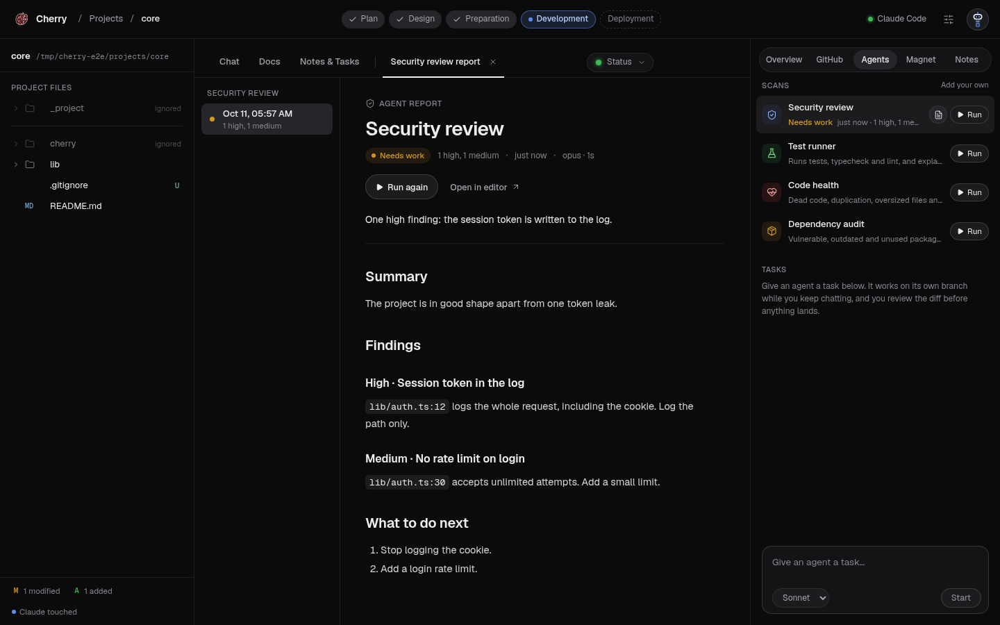

# Cherry

Cherry is a local workspace where Claude Code plans, documents and builds software the way a
software engineer would: **survey first, decide, document, then build.** It runs on your own
computer at `127.0.0.1`, reads your `~/Projects` folder, and drives your local `claude` CLI.

It is not a code editor and not a vibe-coding tool. You read code and docs here, you make the
decisions here, and Claude does the typing, only after you approve.



## What it does

- **Home**: every project in `~/Projects` with its state, phase, git status and next step.
- **New project survey**: seven decision cards (who it is for, scope, stack, data, …), then
  Claude writes `CLAUDE.md`, a PRD, ADRs, the architecture, `STATUS.md` and the first commit.
- **Calibration**: for an existing project, Claude reads it read-only, asks a few questions and
  proposes docs. Nothing is written until you tick the files.
- **Workspace**: file tree with git status, read-only file and diff viewer, Docs reader,
  Notes & Tasks, and a chat with Claude (plan mode, model, effort, attachments). Every edit and
  command waits for your approval.
- **Scan agents**: one click runs a read-only Security review, Test runner, Code health or
  Dependency audit and saves a report you read in the centre. Add your own in
  `~/.cherry/agents/`.
- **Background agents**: give a task; it works on its own git worktree and branch while you
  keep chatting, then you review the diff and Accept or Discard.
- **GitHub**: pull, push (after approval), open pull requests.
- **Magnet**: an assistant across all your projects ("What's stuck this week?"), read-only,
  with proposed actions you approve.

## Requirements

- Linux (macOS and Windows are not supported yet).
- [Claude Code](https://claude.com/claude-code), signed in (`claude auth login`).
- git. [GitHub CLI](https://cli.github.com) `gh` is optional (GitHub box, Push, new repos).
- [mise](https://mise.jdx.dev), or Node 22 and pnpm 12 on your own.

## Install

```bash
git clone https://github.com/syedmehedihussain/cherry.git
cd cherry
mise install               # Node 22 + pnpm from mise.toml
pnpm install
./scripts/install-cli.sh   # puts `cherry` in ~/.local/bin
cherry                    # starts Cherry and opens it in your browser
```

`cherry` prints a one-time login link and opens it. Your projects are read from `~/Projects`
(change it in Settings). Cherry only listens on `127.0.0.1`.

| Command | Does |
| --- | --- |
| `cherry` | start and open the browser (`--no-open` only prints the link) |
| `cherry down` / `status` | stop / show whether it runs |
| `cherry open <project>` | open a project's workspace |
| `cherry doctor` | check Node, git, gh and Claude Code |
| `cherry logout` | end every browser session |
| `cherry install-service` | start at login (systemd user service) |

To update: `git pull && pnpm install`, then `cherry down && cherry`.

## Claude Code skill

The repo ships a skill, [`.claude/skills/cherry`](.claude/skills/cherry/SKILL.md), that teaches
Claude Code how to install, run, use and troubleshoot Cherry, and how to drive a running copy
(start scans and agents, read reports) through `scripts/api.sh`. Claude Code picks it up
automatically inside this repo. To have it in every project:

```bash
mkdir -p ~/.claude/skills && cp -r .claude/skills/cherry ~/.claude/skills/
```

## Safety

- The daemon binds `127.0.0.1` only and every request needs a session cookie from the login
  link; Host and Origin are checked ([`docs/security.md`](docs/security.md)).
- Claude never edits a file or runs a command in chat without your approval. `sudo`, force
  pushes to main and `rm -rf` outside the project are blocked outright.
- Secret files (`.env`, keys) are never read.
- Your notes in `_project/` stay out of git.

## Develop

```bash
pnpm dev          # daemon (127.0.0.1:4317) + web (127.0.0.1:5173) with live reload
pnpm test         # unit tests (vitest)
pnpm test:e2e     # browser tests (playwright)
pnpm lint && pnpm typecheck
```

`pnpm dev` and `cherry` cannot run at the same time. Start with [`CLAUDE.md`](CLAUDE.md), then
[`docs/README.md`](docs/README.md) (a map of every document) and
[`docs/roadmap.md`](docs/roadmap.md).

## Names

| Thing | Name |
| --- | --- |
| App | Cherry |
| Command | `cherry` |
| Repo | `syedmehedihussain/cherry` |
| Assistant | Magnet |
| Config folder | `~/.cherry/` |
| License | MIT |
